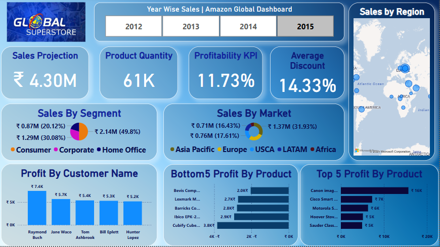

 🌍 Global Superstore Sales Dashboard (Power BI)

Hey there! 👋  
Welcome to my Power BI dashboard project where I’ve explored, transformed and visualised sales data using the **Global Superstore** dataset.

This dashboard gives a clear picture of how sales, profits, discounts, and products performed across different regions and customer segments from **2012 to 2015** using interactive charts,slicer and cards.

🖼️ Dashboard Preview

 📊 What’s Inside?

✨ Here's what you’ll find in the dashboard:

- 💰 **Sales Projection** – ₹4.30M
- 📦 **Total Products Sold** – 61K units
- 📉 **Average Discount** – 14.33%
- 📈 **Profitability KPI** – 11.73%
- 📍 **Sales by Region (Map View)**
- 🧩 **Top & Bottom Products by Profit**
- 🧑‍💼 **Customer-wise Profit Breakdown**
- 🌎 **Sales by Segment & Market (Pie charts)**

   

 💡 About the Project

This dashboard is built for **practice and learning** purposes using sample data.  
It helped me get hands-on with **Power BI visuals, KPIs, maps, and interactivity**.

🙋‍♀️ Created By

Made with love ❤️ by **Aashi Jain**
[GitHub Profile](https://github.com/AashiJain971)

 
 
 📌 Note
It’s all demo data for learning and showcasing BI skills.
